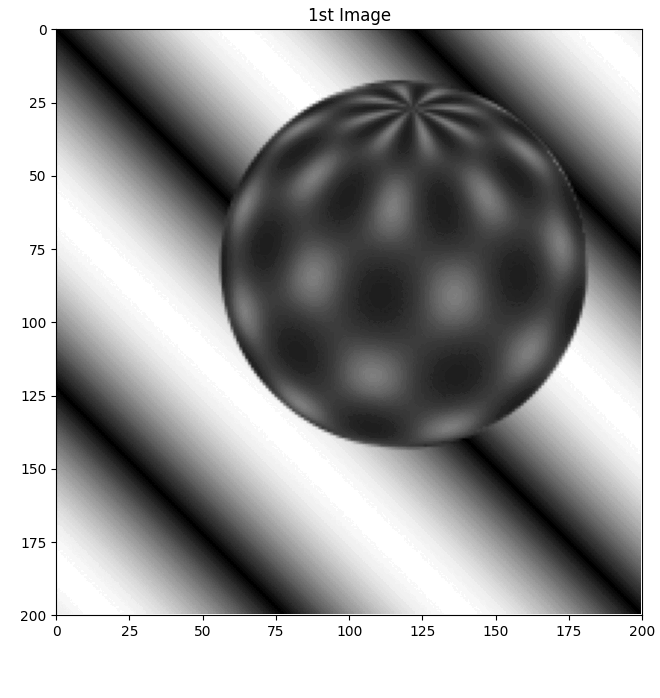

# Advanced Computer Vision: Homework

## Contents
#### [Project 1: Image Matching](#project-1-image-matching-1)
* keywords: Block Matching
#### [Project 2: Optical Flow](#project-2-optical-flow-1)
* keywords: Horn–Schunck, Lucas-Kanade
#### [Project 3: Stereo Reconstruction](#project-3-stereo-rectification-1)
* keywords: stereo camera, disparity map, point clouds
#### Final Project: Improved Real-Time Pipeline for 3D Mesh Reconstruction from RGB-D Cameras
]
* external link: [abstract](https://twwang97.github.io/publication/2009-10-01-paper-title-number-1), [video](https://youtu.be/6GXKYBE1w_E)
#### Note
* Some [notes and references](#note-1) are listed at the bottom of this page. 

---
# Project 1: Image Matching
#### Python Usage
```
python3 image_matching.py
```


---
# Project 2: Optical Flow
#### Python Usage
```
python3 optical_flow.py
```
* Results from Horn–Schunck optical flow:


* Results from Lucas-Kanade optical flow:


---
# Project 3: Stereo Reconstruction
#### Python Usage
```
python3 stereo_reconstruction.py
```


---
# Note
* All output files are saved in the `results` folder. 
* Some projects are modified from the class of Advanced Computer Vision at National Taiwan University.

---
# Resources and References
[1] Lecture Notes from Chiou-Shann Fuh's class of Advanced Computer Vision (Spring 2023) <br>
[2] optical flow from lmiz100's [github](https://github.com/lmiz100/Optical-flow-Horn-Schunck-method) <br>
[3] stereo algorithm from sushlokshah's [github](https://github.com/sushlokshah/stereo-reconstruction) <br>
[4] stereo [datasets](https://vision.middlebury.edu/stereo/data/scenes2014/) <br>